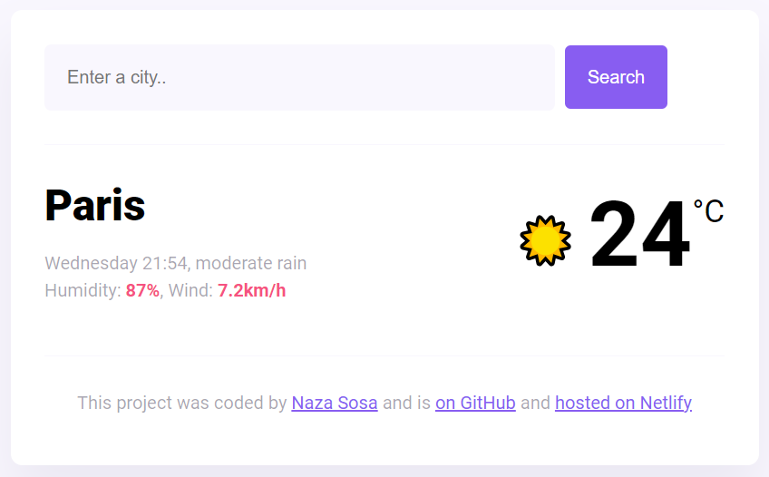

# My First SheCodes Project - Weather App

## Table of contents

- [Overview](#overview)
  - [Screenshot](#screenshot)
  - [Links](#links)
- [My process](#my-process)
  - [Build with](#build-with)

## Overview
This project is a weather app that utilizes the SheCodes API to fetch weather data for select countries.
Users can search for specific countries and viwe the current temperature.
The primary focus of this project was to demonstrate the integration of the SheCodes API and the manipulation of weather data.

### Screenshot

  

    
  

### Links
- Repository URL: [https://github.com/nazasosaro/my-first-shecodes-project/tree/main]
- Weather App URL: [https://my-first-shecodes-project-weather.netlify.app/]

## My process
### Build with
- HTML
- CSS
- Vainilla JavaScript
